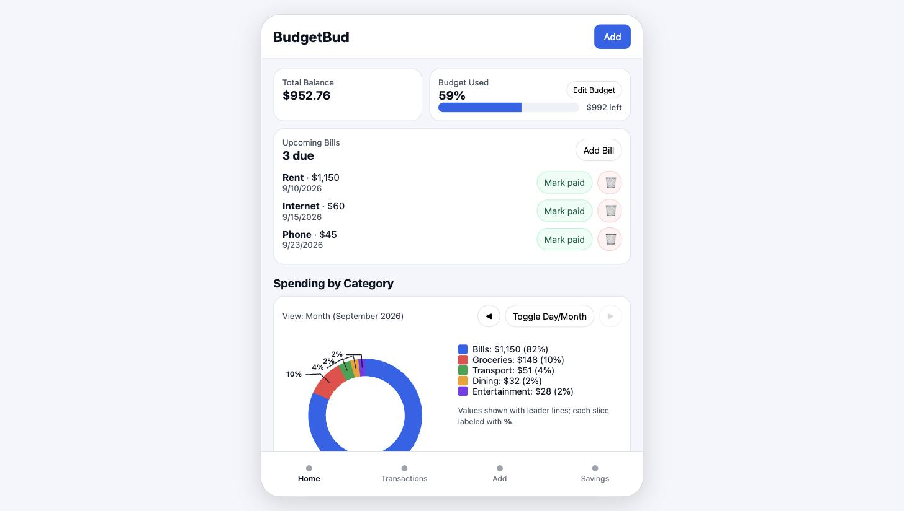
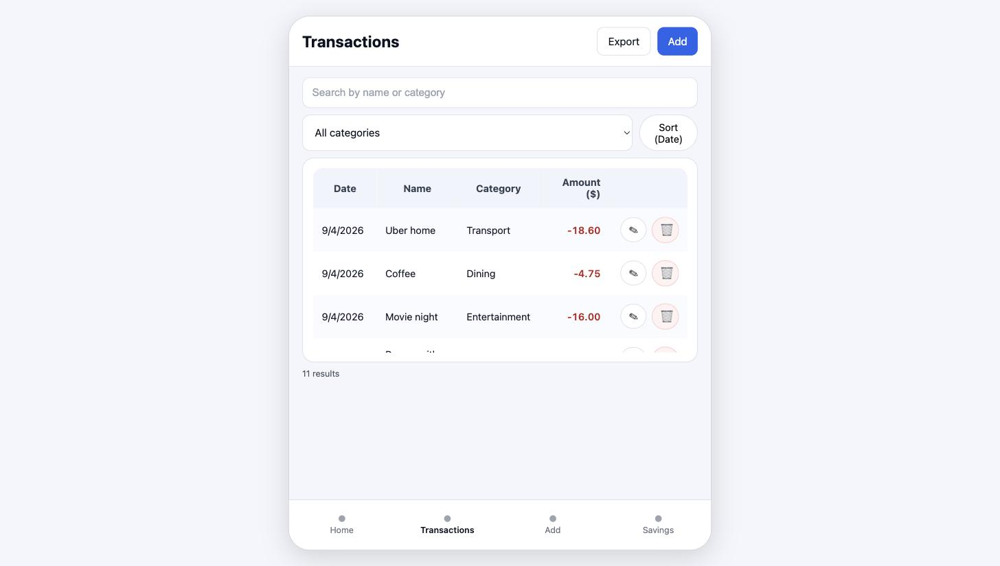
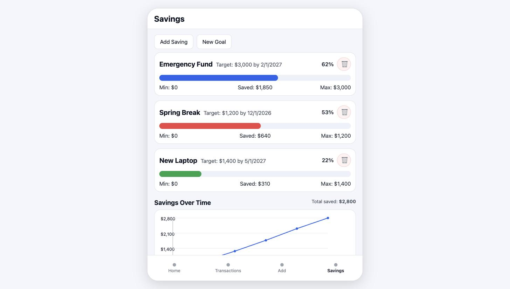

# BudgetBud

A budgeting app for tracking spending, bills, and savings goals — built as a
mobile-style single-screen app in vanilla JavaScript, with hand-drawn SVG charts
and no charting or UI framework anywhere in the stack.

**[Try the live demo →](https://anishchidella23.github.io/BudgetBud/)** (open it
and hit **Load demo data** for a populated month)



## Features

**Home** — running balance, monthly budget with a progress bar, and upcoming
bills. Marking a bill paid records the payment as a transaction, so the money
actually leaves your balance. A donut chart breaks spending down by category
with leader-line labels, and the day/month toggle pages back through previous
periods (forward navigation stops at today).

**Transactions** — full history with live search across names and categories, a
category filter, a date/amount sort toggle, inline edit and delete, and CSV
export of whatever is currently on screen.

**Savings** — goals with progress toward each target, plus a line chart of total
savings over time.

| Transactions                                  | Savings                             |
| --------------------------------------------- | ----------------------------------- |
|  |  |

Everything is stored in `localStorage`, so the app is fully client-side — no
account, no server, no data leaving the browser.

## Running it

```bash
npm install
npm run dev      # http://localhost:5173
```

```bash
npm test         # 80 unit and DOM tests
npm run lint     # eslint
npm run format   # prettier
npm run build    # production build into dist/
```

## How it's put together

```
index.html            markup for all three screens and the modal sheets
src/
  main.js             entry point: loads state, wires the shell, renders
  state.js            state shape and the pure selectors derived from it
  actions.js          every mutation, each one persisting as it goes
  storage.js          localStorage persistence and schema migration
  forms.js            modal form submissions, shared by add and edit
  demo.js             sample data for the hosted demo
  render/             one module per screen (home, transactions, savings)
  charts/             donut.js, line.js, and shared SVG helpers
  ui/                 DOM lookup and modal open/close
  utils/              date and formatting helpers
tests/                unit tests, plus DOM tests that boot the real page
```

Rendering is kept separate from state. Everything in `state.js` is a plain
function of a state object — `computeTotals`, `spendingByCategory`,
`filterTransactions`, `savingsSeries` — so the numbers can be tested without a
DOM, and every write goes through `actions.js`, which persists as it mutates so
the stored copy never drifts from what's on screen. Each screen module exposes a
`bind` (event listeners, attached once at startup) and a `render` (paint from
current state).

### Derived, not stored

Anything that can be computed is computed. A goal's balance and the savings
chart are both derived from a single `contributions` log rather than stored
alongside it, which is what makes deleting a goal take its money out of the
chart automatically instead of leaving it stranded. Persisted state carries a
`version`, and `storage.js` migrates older shapes forward on load.

### The charts

Both charts are drawn by hand with the SVG DOM API. The donut computes annular
arc paths from polar coordinates; a single-category month is drawn as a stroked
circle, since an arc from an angle back to itself has nothing to render. Leader
labels are laid out in a second pass that pushes each one clear of its
neighbour — several thin slices in a row would otherwise stack their labels two
pixels apart.

### Dates

Dates are stored as `YYYY-MM-DD` and always parsed as local dates —
`new Date("2025-11-07")` parses as UTC midnight, which lands on the previous day
in western timezones, so `parseLocalDate` splits the string by hand instead.
Savings months are keyed `YYYY-MM` so the series stays ordered across a year
boundary.

## Project history

This started as a 1,300-line single-file prototype for a UI design course:
markup, styles, and logic in one `index.html`, with state held in memory. The
rewrite split it into modules and fixed the bugs that structure was hiding.

Round one — structure:

- **State is persisted.** A refresh silently wiped every transaction and goal.
- **Budget usage follows the month being viewed.** It measured the _monthly_
  budget against _all-time_ spending, so the progress bar disagreed with the
  month-filtered chart directly beneath it.
- **User text is escaped before it reaches `innerHTML`.** A transaction named
  `Coffee <b>oat</b>` used to render as markup.
- **Sort mode survives a re-render.** It lived in a local that every re-render
  reset, so adding or deleting a row reverted the user's sort.

Round two — the data model and the things built on it:

- **Bills move money.** Marking one paid only flipped a flag; the budget never
  noticed. It now writes a linked transaction, and unmarking removes it.
- **Records have stable ids.** Deleting worked off array indices.
- **Savings can't outlive their goal.** Contributions are a log, and deleting a
  goal deletes them with it, so the chart can no longer count money attributed
  to a goal that no longer exists.
- **Transactions can be edited,** instead of delete-and-retype.
- **Categories can be added** from the transaction sheet.
- **The frame fits the window.** It was a fixed 640×960 mock-up, so on a laptop
  shorter than the frame the bottom tab bar sat below the fold, unreachable.
- **Empty states everywhere,** including a demo-data loader, since a budgeting
  app with no data in it shows nothing but zeroes.

## License

MIT
